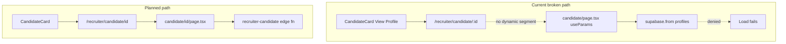

# Home i18n, recruiter hero slide, and broken recruiter flows

## Gap inventory

| Issue | Severity | Where |
|-------|----------|--------|
| **Broken candidate URL** | Critical | [`CandidateCard.tsx`](components/CandidateCard.tsx) links to `/recruiter/candidate/${id}` but route is [`app/recruiter/candidate/page.tsx`](app/recruiter/candidate/page.tsx) (no `[id]` segment). Next.js will not pass `id` via `useParams()`. |
| **Broken candidate data fetch** | Critical | [`app/recruiter/candidate/page.tsx`](app/recruiter/candidate/page.tsx) reads `profiles` with the anon client. RLS only allows `auth.uid() = id` ([`20260428192518_...sql`](supabase/migrations/20260428192518_8188b051-823f-4380-9c78-efa93744dda7.sql)). Recruiters cannot load candidate rows client-side; search works only because [`recruiter-search`](supabase/functions/recruiter-search/index.ts) uses the service role. |
| **Home recruiter CTA not i18n** | High | [`app/page.tsx`](app/page.tsx) lines 63-80: hardcoded English. |
| **Bottom developer CTA not i18n** | High | Same file lines 87-88: title/subtitle hardcoded PT while button uses `t("home.ctaJoin")`. |
| **No recruiter hero slide** | High (requested) | [`lib/home-banner-slides.ts`](lib/home-banner-slides.ts) has 3 slides (dev, jobs, tools); no recruiter entry. |
| **Express Interest stub** | Medium | [`app/recruiter/search/page.tsx`](app/recruiter/search/page.tsx) `onExpressInterest` only toasts; does not navigate or call `recruiter-interest`. |
| **Seniority filter dead** | Medium | Search UI exposes seniority but [`recruiter-search`](supabase/functions/recruiter-search/index.ts) never applies it; `profiles` has no `seniority` column ([`types.ts`](integrations/supabase/types.ts) `profiles.Row`). |
| **Banner `/auth` vs modal** | Low | Hero slides link to `/auth`; home bottom CTA uses `openAuthModal`. Both work (`/auth` exists) but UX is inconsistent. |
| **Stripe fallback URLs** | Low | [`stripe-recruiter-checkout`](supabase/functions/stripe-recruiter-checkout/index.ts) defaults to `localhost:5173` if `return_url` missing. |
| **No auth guard on recruiter app** | Low | Dashboard/search render empty when logged out instead of redirecting to `/recruiter/auth`. |

**Out of scope (per your answer):** i18n for recruiter portal pages and [`RecruiterLayout.tsx`](components/RecruiterLayout.tsx) (English-only).

---

## 1. Fix candidate profile route and API

**Route move**

- Move [`app/recruiter/candidate/page.tsx`](app/recruiter/candidate/page.tsx) to `app/recruiter/candidate/[id]/page.tsx` (same component logic, `id` from `useParams`).
- Delete the old flat `page.tsx` to avoid duplicate routes.

**New edge function: `recruiter-candidate`**

- Add [`supabase/functions/recruiter-candidate/index.ts`](supabase/functions/recruiter-candidate/index.ts) mirroring auth pattern from `recruiter-search`:
  - Verify authenticated user has `recruiter_profiles` row.
  - Load `recruiter_subscriptions.plan`.
  - Fetch candidate where `id = candidate_id` AND `visible_to_recruiters = true`.
  - Return 404 if not found or not visible.
  - Apply same obfuscation rules as search (free: masked name, `is_blurred`, omit/limit sensitive fields; paid: full profile).
  - Optionally increment/log a profile view for dashboard stats (today `stats.views` is always 0).

**Update candidate page**

- Replace direct `supabase.from("profiles")` with `supabase.functions.invoke("recruiter-candidate", { body: { candidate_id: id } })`.
- Handle loading/error states; show upgrade hint when `is_blurred` on free tier.

**Wire Express Interest on search**

- In [`CandidateCard.tsx`](components/CandidateCard.tsx): change `onExpressInterest` default behavior or pass handler from search that `router.push(`/recruiter/candidate/${id}`)` (optionally `?contact=1` to focus message box).
- Remove toast-only stub in [`app/recruiter/search/page.tsx`](app/recruiter/search/page.tsx).

**Seniority filter (pick one, recommend A)**

- **A (minimal):** Remove seniority `<Select>` from search UI until `profiles` has a real field.
- **B:** Map UI values to `years_experience` ranges in `recruiter-search` (e.g. Mid 3-5, Senior 5+). Document mapping in code.

Recommend **A** to avoid misleading filters.

**Docs**

- Update [`AGENTS.md`](AGENTS.md) route note and add `recruiter-candidate` to edge function list.

---

## 2. Home page i18n

Add keys to [`lib/i18n.tsx`](lib/i18n.tsx) (pt + en):

| Key | Purpose |
|-----|---------|
| `home.recruiter.title` | Recruiter CTA heading |
| `home.recruiter.desc` | Recruiter CTA body |
| `home.recruiter.cta` | Button label |
| `home.ctaFinal.title` | Bottom strip heading |
| `home.ctaFinal.sub` | Bottom strip subtitle |

Update [`app/page.tsx`](app/page.tsx) recruiter section and bottom strip to use `t(...)`.

Optional: add `home.recruiter.*` to SEO component on home if you want localized meta (currently hardcoded PT in `<SEO>`).

---

## 3. Recruiter hero slide in existing carousel

**No new carousel component** - extend [`lib/home-banner-slides.ts`](lib/home-banner-slides.ts):

- Add 4th slide `id: "recruiter-hero"` with `html_pt` / `html_en` using existing `slideShell`, emerald accent styling (match jobs slide pattern).
- Copy structure from other slides: badge, h1, p, two CTAs:
  - Primary: `/recruiter/auth` (e.g. "Sou recrutador" / "I'm hiring")
  - Secondary: `/recruiter/pricing` (e.g. "Ver planos" / "View plans")
- Append to `HOME_BANNER_SLIDES` array (order suggestion: default dev hero first, recruiter slide second or last; **recommend position 2** so recruiters see it early without displacing primary dev funnel).

**i18n for slide copy**

- Store pt/en strings in `home-banner-slides.ts` (same pattern as jobs/tools slides), **or** add matching `home.banner.recruiter.*` keys in `i18n.tsx` and build slide HTML via a small helper that reads locale (only needed if you want single source of truth). Pragmatic choice: **duplicate in slide file** for this PR to avoid refactoring carousel to React; home card section uses `i18n.tsx` keys.

Keep the existing recruiter **card** section on [`app/page.tsx`](app/page.tsx) as secondary CTA (now i18n), unless you prefer removing it after the hero slide (optional cleanup).

---

## 4. Small related fixes (same PR)

| Fix | File |
|-----|------|
| Auth redirect when `!user` on dashboard/search/candidate | Each recruiter page or shared `useRecruiterAuth` hook |
| Stripe `success_url` / `cancel_url` use `Deno.env.get("SITE_URL")` with Next origin fallback, not Vite `5173` | [`stripe-recruiter-checkout/index.ts`](supabase/functions/stripe-recruiter-checkout/index.ts) |
| Align default hero "Join" link with modal (optional): use `/auth?mode=signup` or keep `/auth` | [`lib/home-banner-slides.ts`](lib/home-banner-slides.ts) |

---

## 5. Verification checklist

- `/recruiter/candidate/<uuid>` loads for logged-in recruiter with visible candidate.
- Free tier shows obfuscated data on detail page; paid shows full profile.
- "View Profile" and "Express Interest" from search reach detail page.
- Home toggles PT/EN: recruiter card + bottom strip translate.
- Carousel shows 4 slides; recruiter slide CTAs hit `/recruiter/auth` and `/recruiter/pricing`.
- `npm run build` passes; manual test recruiter signup flow unchanged.

---

## File touch summary

| Action | Path |
|--------|------|
| Move + update | `app/recruiter/candidate/[id]/page.tsx` |
| New | `supabase/functions/recruiter-candidate/index.ts` |
| Edit | `components/CandidateCard.tsx`, `app/recruiter/search/page.tsx` |
| Edit | `app/page.tsx`, `lib/i18n.tsx`, `lib/home-banner-slides.ts` |
| Edit | `supabase/functions/recruiter-search/index.ts` (seniority removal only) |
| Edit | `supabase/functions/stripe-recruiter-checkout/index.ts`, `AGENTS.md` |
